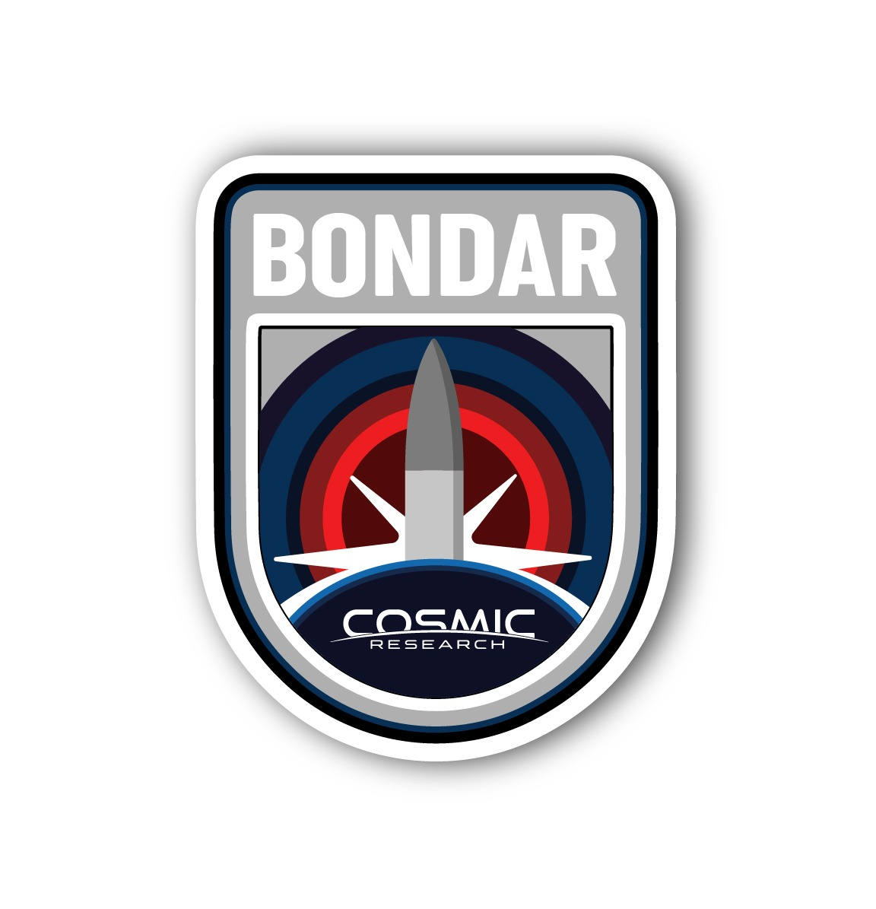

# Static test software

Application for Bondar's static test data acquisition system. The core follows a topic-based (events) publish-subscribe pattern. This allows great scalability and modularity for this application without compromising efficiency. By default events are processed asynchronously by a pool of threads.

<p align="center">
  
  
</p>

This software is being developed by the Avionics Squad from Cosmic Research for the Bondar mission.

## Requirements

In order to build this software you will need the following software installed in your system,

* CMake 3.1+
* Any working C++ and C compilers for your target system (supporting at least C++14)
* g3log (https://github.com/CosmicResearch/g3log)

## Build instructions

```
mkdir build && cd build
cmake ..
make
```

## Build instructions for cross compiling

For cross compilation we provide the toolchain.cmake file. You might need to modify it, it is configured to build for a Linux on ARM system.

```
mkdir build && cd build
cmake .. -DCMAKE_TOOLCHAIN_FILE:PATH="..\toolchain.cmake"
make
```

## License

Copyright 2019, Associació Cosmic Research, Guillem Castro, Joan Mitjans.

This program is free software: you can redistribute it and/or modify it under the terms of the GNU General Public License as published by the Free Software Foundation, either version 3 of the License, or (at your option) any later version.

This program is distributed in the hope that it will be useful, but WITHOUT ANY WARRANTY; without even the implied warranty of MERCHANTABILITY or FITNESS FOR A PARTICULAR PURPOSE. See the GNU General Public License for more details.
